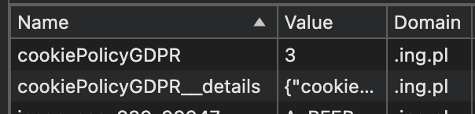
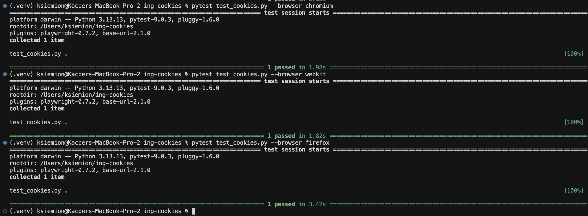
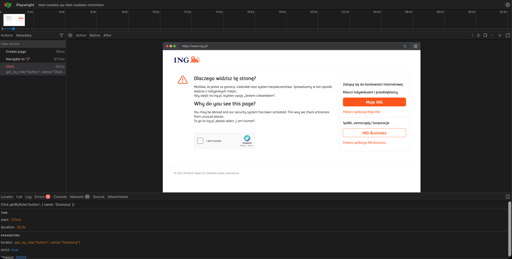

# ING Cookies

Automatyzacja akceptowania cookie analitycznych na stronie `ing.pl`.
Test po kolei weryfikuje:
- wejście na stronę `ing.pl`
- otwarcie panelu wyboru ciasteczek przez przycisk "Dostosuj"
- przełączenie opcji "Cookies analityczne"
- zaakceptowanie zaznaczonych cookies
- sprawdzenie, czy istnieją ciasteczka `cookiePolicyGDPR` i `cookiePolicyGDPR__details`
- sprawdzenie, czy `cookiePolicyGDPR` ma wartość 3 (zgodnie z tym, co wyszło po ręcznym sprawdzeniu)


## Uruchomienie

1. Sklonowanie repozytorium
```bash
git clone https://github.com/ksiemionek/ing-cookies.git
cd ing-cookies
```

2. Stworzenie środowiska wirtualnego z potrzebnymi bibliotekami
```bash
python -m venv .venv
source .venv/bin/activate
pip install -r requirements.txt
playwright install --with-deps
```

3. Uruchomienie testu
Uruchomienie z widoczną przeglądarką
```bash
pytest test_cookies.py --headed 
```

Uruchomienie z opóźnieniem, ułatwia widoczność kolejnych kroków
```bash
pytest test_cookies.py --headed --slowmo 1000
```

Uruchomienie w konkretnej przeglądarce
```bash
pytest test_cookies.py --browser chromium
pytest test_cookies.py --browser webkit
pytest test_cookies.py --browser firefox
```


Uruchomienie we wszystkich przeglądarkach
```bash
pytest test_cookies.py --browser chromium --browser webkit --browser firefox
```

## GitHub Actions
Ze względu na widoczne na zdjęciu poniżej zabezpieczenie hCaptcha, automatyczne testy przez GitHub Actions są niemożliwe do przeprowadzenia.


